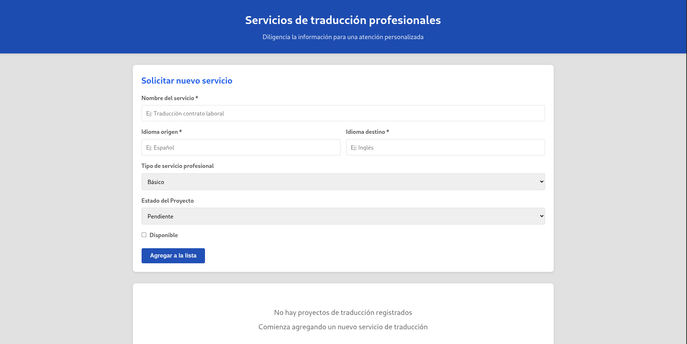

# Servicios de traducción profesionales

Esta aplicación, permite realizar operaciones **CRUD** completas sobre servicios de traducción con una interfaz intuitiva y optimizada.



## Tecnologías principales

- **React** – Biblioteca de interfaz de usuario
- **TypeScript** – Tipado estático y mejor mantenibilidad
- **Vite** → Herramienta de desarrollo y build ultrarrápida
- **pnpm** – Gestor de paquetes eficiente
- **CSS puro** – Estilos personalizados con paleta Azure Dev

## Características clave

- Formulario dinámico para **crear** y **editar** servicios
- Listado responsive con **ServiceCard** y badges de estado
- Estados de proyecto: **Pendiente** • **En Proceso** • **Completado**
- Edición en línea: al pulsar "Editar" el formulario se precarga automáticamente
- Eliminación con **confirmación** integrada
- IDs únicos generados con timestamp
- Validación básica en frontend
- Diseño limpio inspirado en **Azure Dev** (tonos azules sólidos)

## Arquitectura

El proyecto utiliza **State Lifting** (levantamiento de estado) para mantener la lógica centralizada:


bootcamp/week-02/3-proyecto/starter/
├── src/
│   ├── components/
│   ├── App.tsx
│   └── main.tsx
├── package.json
└── README.md (descripción de tu implementación)


Tipos principales definidos en `src/types.ts` para facilitar futuras extensiones.

## Instalación y ejecución

Requisitos previos:

- [Node.js](https://nodejs.org/) ≥ 18
- [pnpm](https://pnpm.io/) (recomendado)

```bash
# 1. Clonar el repositorio
git clone <URL-del-repositorio>
cd translation-service-management

# 2. Instalar dependencias
pnpm install

# 3. Iniciar modo desarrollo<a href="http://localhost:5173" target="_blank" rel="noopener noreferrer nofollow"></a>
pnpm run dev

# 4. Construir versión de producción
pnpm run build

# 5. Previsualizar build (opcional)
pnpm run preview