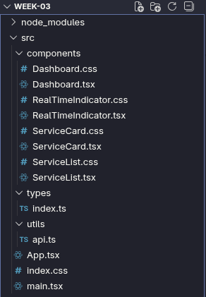

# Servicios de traducción profesionales || Week 03

La aplicación permite monitorear estadísticas en tiempo real, visualizar flujos de trabajo de palabras procesadas y ver un catálogo dinámico de servicios.

---

## Tecnologías utilizadas

- **React**: Biblioteca principal para la interfaz de usuario  
- **TypeScript**: Tipado estático para asegurar la robustez del código y evitar errores en producción  
- **Vite**: Herramienta de construcción (bundler) de última generación para un desarrollo ultrarrápido  
- **PNPM**: Gestor de paquetes eficiente basado en enlaces simbólicos  
- **CSS3 (Flexbox & Grid)**: Para un diseño responsivo y moderno sin dependencias externas  

---

## Aquitectura

El proyecto fue concebido bajo el principio de **Arquitectura Limpia (Clean Architecture)**, separando las responsabilidades en capas claras.

### 1. Capa de Datos (`src/utils/api.ts`)

Se implementó un motor de datos asíncrono que simula el comportamiento de una API real.

- **Polling automático** → Un sistema que actualiza métricas cada 5 segundos  
- **Simulación de latencia** → Uso de promesas y `setTimeout` para emular tiempos de respuesta de red  
- **Manejo de concurrencia** → Implementación de `AbortController` para cancelar peticiones pendientes y evitar fugas de memoria o colisiones de estado  


---

## Estructura de archivos



---

### 2. Capa de componentes (`src/components/`)

La UI está dividida en componentes atómicos y modulares:

- **`Dashboard.tsx`** → El orquestador principal que define el layout  
- **`ServiceCard.tsx`** → Visualización de KPIs (pedidos, palabras, capacidad)  
- **`RealTimeIndicator.tsx`** → Monitor en vivo con barras de progreso animadas  
- **`ServiceList.tsx`** → Catálogo dinámico con búsqueda y filtrado reactivo  

---

### 3. Capa de tipado (`src/types/index.ts`)

Centralización de interfaces para asegurar que los datos fluyan correctamente entre la API y los componentes, garantizando que un `Service` siempre tengan la estructura esperada.

---

## Instalación y ejecución

Para levantar este proyecto localmente usando **pnpm**, sigue estos pasos:

### 1. Clonar el repositorio

```bash
git clone <tu-url-del-repo>
cd week-03
```

### 2. Instalar dependencias

```bash
pnpm install
```

### 3. Iniciar el servidor de desarrollo

```bash
pnpm dev
```

### 4. Abrir en el navegador

Visita:

```
http://localhost:5173
```

---

## 📋 Funcionalidades destacadas

- **Buscador inteligente** → Filtrado instantáneo por especialidad (Legal, Médica, Tech)  
- **Modo en vivo** → Indicador visual de velocidad de procesamiento (palabras por minuto)  
- **Diseño responsivo** → Adaptación total usando `CSS Grid`  
- **Manejo de errores** → Detecta cancelaciones de peticiones y fallos de red  

---

## Notas de desarrollo

Durante la creación, se puso especial atención al **StrictMode** de React, asegurando que los efectos secundarios (`useEffect`) limpien sus suscripciones y controladores de aborto correctamente, evitando comportamientos erráticos en el navegador.

---

**Desarrollado como parte del taller de React - Semana 03.**


