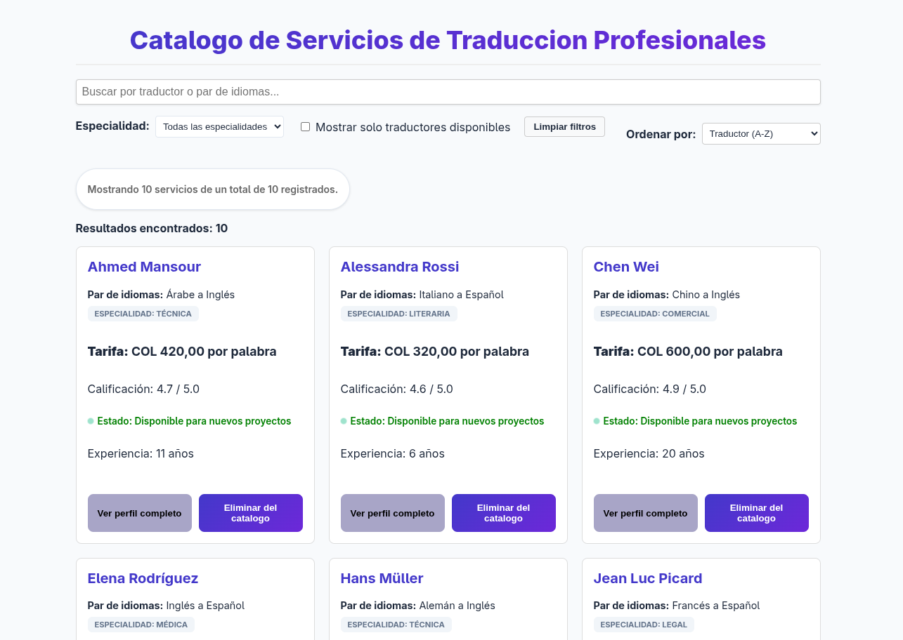
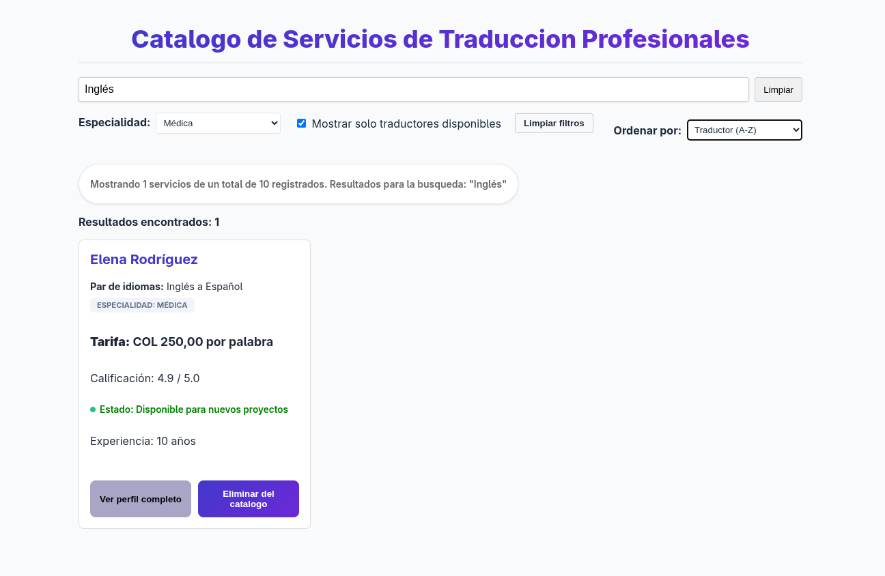

# Proyecto: Catálogo de servicios de traducción profesionales

## Descripción del dominio
Este proyecto implementa un catálogo interactivo diseñado para una agencia de **Servicios de Traducción Profesionales**. La plataforma permite a los usuarios buscar traductores expertos basándose en pares de idiomas, especialidades técnicas y criterios de presupuesto.

El sistema gestiona datos complejos como:
* **Especialidades:** Legal, Médica, Técnica, Literaria y Comercial.
* **Tarifas:** Cálculo basado en costo por palabra (USD).
* **Disponibilidad:** Renderizado en tiempo real del estado operativo del traductor.

---

## Funcionalidades evaluadas

### 1. Renderizado condicional e interfaz
* **Estado de Carga:** Pantalla de espera mientras se procesan los datos.
* **Estado Vacío:** Mensaje personalizado cuando no hay coincidencias con los filtros.
* **Badges Dinámicos:** Etiquetas de color para disponibilidad y especialidades sin uso de emoticones.
* **Contador de Resultados:** Actualización reactiva del número de servicios encontrados.

### 2. Filtrado y búsqueda (Tiempo real)
* **Búsqueda Case-Insensitive:** Filtra simultáneamente por nombre del traductor, idioma de origen e idioma de destino.
* **Filtros de Especialidad:** Selector dinámico por categorías de traducción.
* **Filtro Booleano:** Opción para mostrar únicamente traductores disponibles de inmediato.
* **Limpieza de Filtros:** Botón global para resetear todos los parámetros de búsqueda.

### 3. Ordenamiento (sin mutación)
* Ordenamiento alfabético (A-Z, Z-A).
* Ordenamiento por tarifa (Menor a Mayor y viceversa).
* Ordenamiento por calificación (Mejor valorados).
* *Nota: Se utiliza la clonación de arrays para evitar mutar el estado original.*

---

## Tecnologías y calidad de código
* **React 18 + Vite**
* **TypeScript Estricto:** Cero uso de `any` en todo el proyecto. Interfaces definidas para todos los modelos de datos.
* **Hooks Personalizados:** Implementación de `useDebounce` para optimizar el rendimiento de la búsqueda.
* **Componentización:** Separación clara entre componentes lógicos (Catalog) y de presentación (ServiceCard, ServiceList).
* **Documentación Interna:** Uso del estándar **QUÉ/PARA/IMPACTO** en todas las funciones y componentes clave.

---

## Instalación y ejecución

1.  Clonar el repositorio.
2.  Instalar las dependencias:
    ```bash
    pnpm install
    ```
3.  Iniciar el servidor de desarrollo:
    ```bash
    pnpm dev
    ```

---

## Capturas de pantalla

1. **Vista general:** 
2. **Filtros aplicados:** 
3. **Estado no disponible:** 

---
**Desarrollado para la evaluación Week 04 - Bootcamp React**